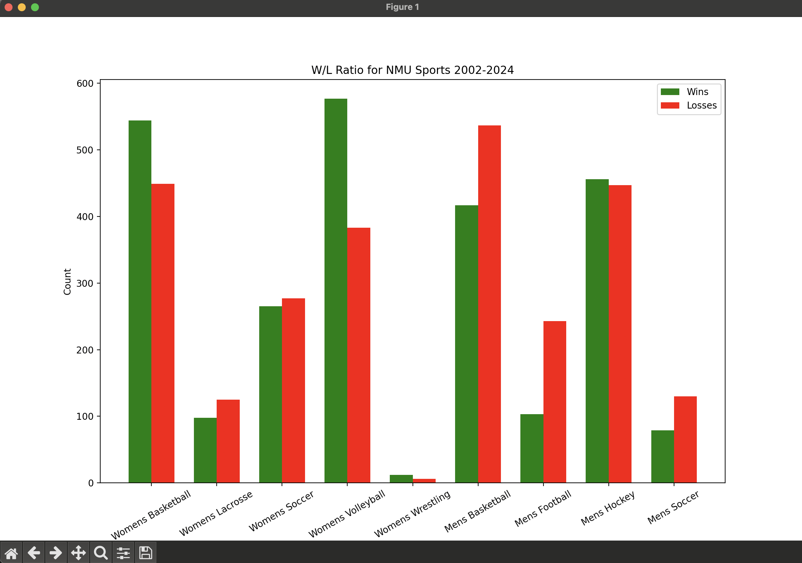

# nmu-athletics-scrape
Scraping all of my universities sports data represnting these stats in different ways.

Currently in development, graph for totals throughout sports done and depicted below.

  
I plan to add more stats, running winstreaks, winning and losing seasons, etc., along with sports that aren't NCAA, and sports with more ambigous scoring, like golf, where it isn't as binary as win or loss.
  
Additionally I plan to link funding to win/loss at NMU, as many people have noticed a discrepancy in funding at NMU.
  
This project is built with **Python** usiing **BeautifulSoup**, the plots are made with **matplotlib**.
